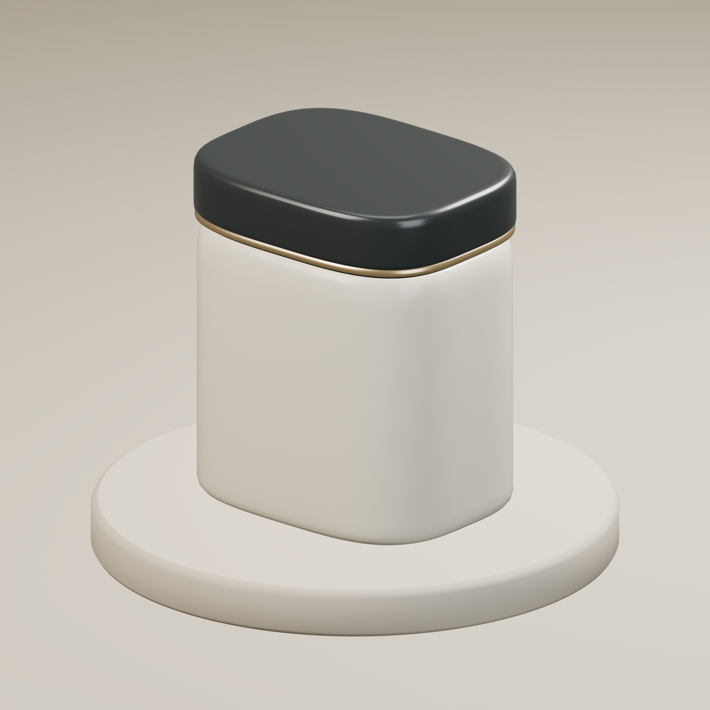

# 商品CG制作の自主制作見本 — GREAT MEDICAL

単純な容器の商品画像と短い回転動画を、同じ3Dモデルから制作する見本です。
架空の無地容器をBlenderで制作しました。AIを用いて制作コードを作成しています。実在のお客様への納品例・実商品の撮影写真ではありません。



## 見本を見る

- [別角度の静止画](samples/angle-2.png)
- [6秒の回転動画（MP4）](samples/turntable-6s.mp4)
- [編集用Blenderシーン](samples/product-studio.blend)
- [容器のみのGLBモデル](samples/product.glb)

寸法や外観を共有して、商品ページ用の画像、色違い、別角度などの制作をご相談いただけます。

## 商品CGの見積相談

**単純な容器・箱1商品：77,000円（税込／税別70,000円）を目安に個別見積。**

想定範囲は、寸法・参考写真・使用権のあるラベルの支給を受け、同一背景の静止画2点と6秒の回転動画1本を制作するものです。形状確認1回、色・光の軽微な調整1回を目安とします。解像度、修正範囲、日程、受領資料を確認して正式な見積と制作条件を合意します。初回相談は無料です。

複雑な機構、透明ガラスや液体、人物、精密な製造用CAD、実写撮影、広告配信、商標調査はこの範囲に含みません。編集用データの納品や多数の色・SKU展開は別途相談となります。公開見本の無地容器は実在製品の正確な再現を保証するものではありません。

**[制作の相談を送る →](https://note.com/byolux/message)**

「商品CG」と、希望する商品・使用場所・希望時期をお知らせください。48時間以内に一次返信します。お問い合わせだけで契約・支払いは発生しません。

[他の制作サービスを見る](https://note.com/byolux/n/ne2ca9fd08556)

## ボトル・ケア容器の外観デザイン

形状・配色・ラベル配置を比較するデザイン案も個別にご相談いただけます。こちらは別見積です。上の見本は無地容器の外観CGです。金型・ねじ・密閉性・充填適合・素材試験などの製造設計は含みません。

## データと検証

制作環境はBlender 4.4.0です。外部のモデル、写真、HDRI、フォントは使っていません。静止画と動画は3Dシーンをレンダリングしています。

静止画2点は2048×2048px、動画は720×720px・24fps・144フレーム・6秒です。GLBは4つのメッシュと4つの材質で、Blenderへの再読み込みを確認しています。Unreal Engineへの読み込み・品質・実行性能は未検証です。現在はUE対応素材として販売していません。

GLBはメートル単位、底面を高さ0に配置した静的なモデルです。9584三角形で、スタジオ背景・カメラ・照明は含みません。編集用Blenderシーンには背景、カメラ、照明、回転アニメーションがあります。動画全144フレームの生成とMP4の復号を確認しました。[検証データ](verification/glb.json)

再生成にはBlender 4.4を使います。既存の出力を上書きしないため、新しい出力先を指定してください。

```sh
blender --background --factory-startup --python scripts/create_scene.py -- --output-dir output-v1
blender --background output-v1/neutral-cosmetic-jar.blend --python scripts/render_turntable.py -- frames-v1
ffmpeg -n -framerate 24 -i frames-v1/frame-%04d.png -c:v libx264 -crf 18 -pix_fmt yuv420p -movflags +faststart output-v1/turntable-6s.mp4
```

生成スクリプトの静止画は1024pxです。公開見本は同じシーンから2048pxで再レンダリングしました。ソフトの計算時間と、相談・制作・確認を含む納品工数は異なります。

## 公開見本の利用条件

`samples/` 内の見本データは [CC BY 4.0](LICENSE-ASSETS.md)、制作・検証スクリプトは [GPL-3.0-or-later](LICENSE-CODE.txt) です。顧客向けに個別制作する成果物の納品範囲・利用条件は案件ごとに合意します。

運営：GREAT MEDICAL株式会社
